# PrivacyProxy — Architecture

> **Status:** living design doc · scope = **M1 core** (the privacy sandwich for AI agents).
> **Render note:** diagrams are [Mermaid](https://mermaid.js.org/) — view on GitHub, in VS Code (Mermaid extension), or any Mermaid-capable viewer to see them as graphics.

---

## 1. Thesis

The strongest models on OpenRouter are **free** — 550B Nemotron, 120B gpt-oss, 70B Llama — and the price is in their own terms:

> *"please do not upload any confidential information or personal data … Your use is logged … and to improve NVIDIA products and services."*

The free endpoints **log and train on everything you send.** PrivacyProxy lets you use them anyway:

> **Use the strongest free models — the ones that log and train on your input — without ever exposing your confidential data.**
>
> *Privacy stays local. Reasoning is rented for free.*

The product is a **transparent, OpenAI-compatible gateway** that sits inside an AI agent's tool loop, anonymizes everything leaving the box, and restores it on the way back.

---

## 2. Threat model & trust boundary

The adversary is **not** a hacker or an exfiltration path. It is the provider's **lawful logging & training pipeline.** The guarantee is therefore a single testable assertion:

> **No bytes the user considers confidential ever appear in the request sent to OpenRouter.**

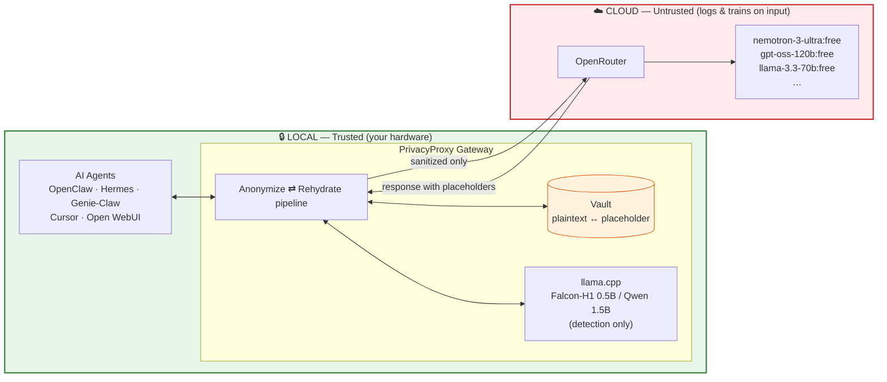

**Key corollaries**

- The **OpenRouter key is not an asset** — it is free, public, and revocable. It lives in config/env, never compiled into source. The asset is the *data in the prompts and tool results*.
- The **Vault holds plaintext originals** so the transform is reversible → it is the crown jewels → local-only, encrypted at rest.
- Clients authenticate to the gateway with a **local key**; they never hold provider secrets.

---

## 3. Design principles

| # | Principle | Consequence |
|---|---|---|
| P1 | **Deterministic floor is the guarantee** | Regex + entropy + gazetteer (pure Rust, fast) own correctness. Statistical detection only *adds* recall. |
| P2 | **Fail closed** | If the egress guard cannot prove safety, the request is blocked, not sent. |
| P3 | **Reversible & session-consistent** | `Alex → __PERSON_1__` is stable for an entire trajectory, or the model hallucinates multiple people. |
| P4 | **Transparent transform** | The gateway never executes the agent's tools; it only transforms the wire. Any agent plugs in via `base_url`. |
| P5 | **Tool output is the real surface** | An agent leaks through `cat .env` and stack traces, not through prose. Detection runs on results, not just prompts. |

---

## 4. Target: AI agents (transparent wire transform)

A chat UI sends one human sentence per turn. An **agent** runs a tool loop — read files, run commands, hit APIs, feed results back, repeat. That reframes the whole gateway: the dominant traffic is **tool calls and tool results**, and the transform must run **in both directions on every hop.**

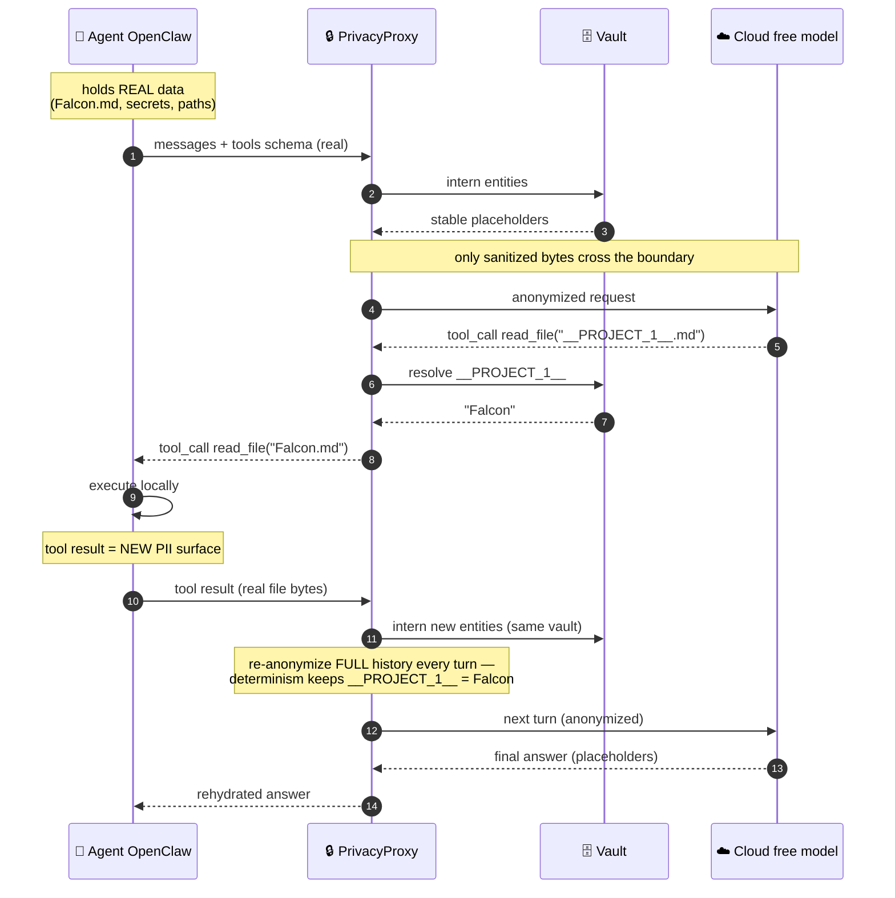

**Three non-negotiable rules** that fall out of this:

1. The agent **always holds real data**; the gateway re-anonymizes the **full message array every turn** (stateless-friendly — the gateway can even restart while the Vault persists).
2. **Tool-call arguments are rehydrated before they reach the agent** — the executor runs `read_file("Falcon.md")`, never the placeholder.
3. **Determinism is mission-critical** across a long trajectory, or the model's reasoning fractures into phantom entities.

> The gateway does **not** execute tools (principle P4). Gateway-side execution is a later, opt-in mode — not the core.

---

## 5. Request lifecycle

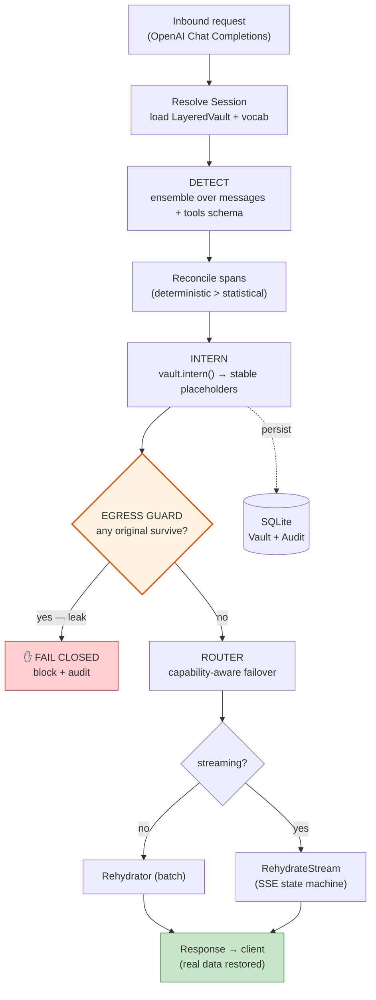

The symmetry to hold onto: **outbound = detect + intern, inbound = scan + resolve, one Vault both directions.**

---

## 6. Workspace / crate architecture

Cargo workspace — keeps compile times and boundaries clean. Later milestones are **new crates**, not edits to these. `pp-core` is the hub: pure domain types and traits, no I/O.

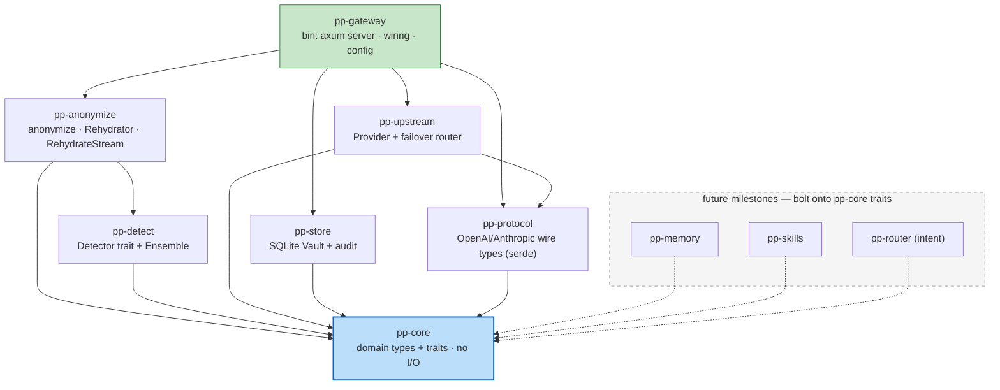

| Crate | Responsibility |
|---|---|
| `pp-core` | `Entity`, `EntityKind`, `Placeholder`, `Vault`/`Detector`/`Provider` traits. No I/O. |
| `pp-protocol` | OpenAI-compatible (and later Anthropic) request/response/delta/tool-call serde models. |
| `pp-detect` | `Detector` trait + `Gazetteer`/`Regex`/`Entropy`/`Ner` impls + `Ensemble` reconciliation. |
| `pp-anonymize` | `anonymize()`, batch `Rehydrator`, streaming `RehydrateStream`. |
| `pp-upstream` | `Provider` trait + OpenRouter client + capability-aware failover router. |
| `pp-store` | SQLite-backed `Vault` (encrypted originals) + audit log. |
| `pp-gateway` | axum routes (`/v1/chat/completions`), pipeline wiring, tower layers, config. |

---

## 7. Core domain model

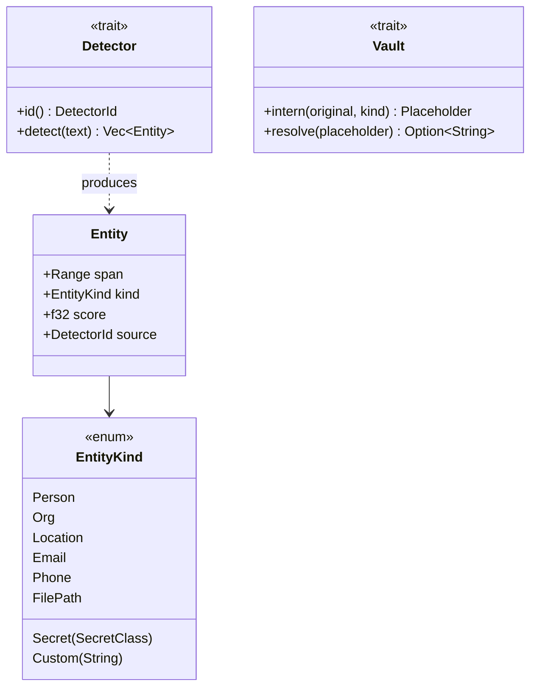

```rust
// pp-core
pub struct Entity {
    pub span: Range<usize>,   // byte offsets into the source text
    pub kind: EntityKind,
    pub score: f32,
    pub source: DetectorId,
}

pub enum EntityKind {
    Person, Org, Location, Email, Phone, FilePath,
    Secret(SecretClass),   // ApiKey, AwsSecret, PrivateKey, Jwt … (must-never-leak tier)
    Custom(String),        // private-vocab tags: "project", "employer"
}

pub trait Detector: Send + Sync {
    fn id(&self) -> DetectorId;
    fn detect(&self, text: &str) -> Vec<Entity>;
}

pub trait Vault: Send + Sync {
    /// Deterministic: same (original, kind) within a session → same placeholder.
    fn intern(&self, original: &str, kind: &EntityKind) -> Placeholder;
    fn resolve(&self, placeholder: &str) -> Option<String>;
}
```

---

## 8. Detection ensemble

Presidio is a Python library — in Rust we replace it with a **trait ensemble**. The deterministic detectors are the safety floor (principle P1); the statistical one is swappable and optional.

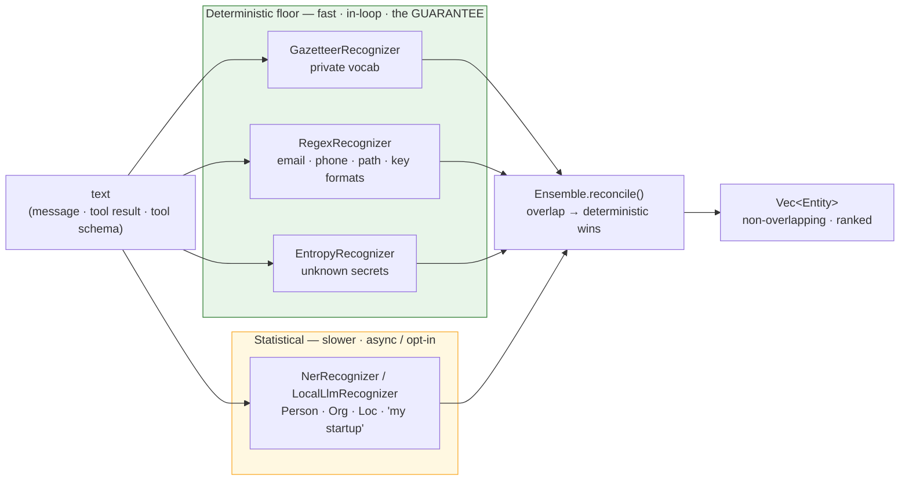

| Detector | Mechanism | Role |
|---|---|---|
| `GazetteerRecognizer` | exact/fuzzy match of the user's private vocab | **primary** — catches "Project Falcon" reliably |
| `RegexRecognizer` | email, phone, paths, key/token formats | high-precision floor |
| `EntropyRecognizer` | Shannon entropy → secrets/tokens | catches *unknown* secrets |
| `NerRecognizer` / `LocalLlmRecognizer` | ONNX (`ort`) or local llama.cpp | **fuzzy fallback** for Person/Org/Loc |

`reconcile()` resolves overlapping spans with **deterministic detectors outranking the statistical one**. NER/regex are CPU-bound → run on `spawn_blocking`/`rayon`, never on the async reactor.

---

## 9. The Vault — two-layer, persistent + ephemeral

Agents need both **stable cross-run meaning** ("Falcon" is always the same token) and **per-trajectory isolation** (two agents don't collide). Resolve with layers.

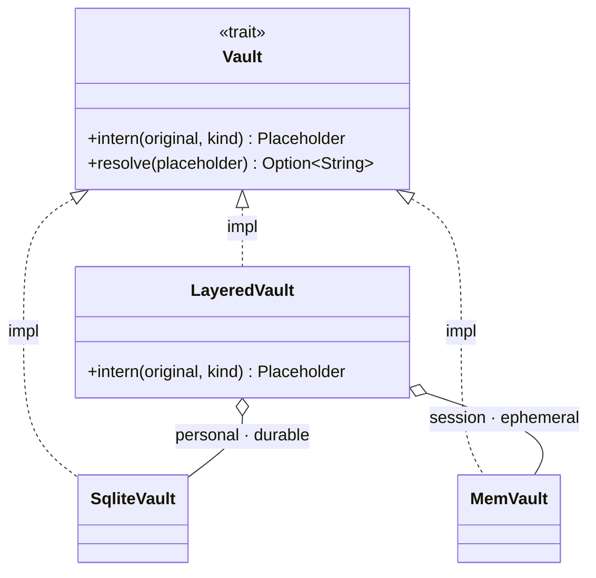

```rust
pub struct LayeredVault {
    personal: Arc<dyn Vault>,  // SQLite, durable — known vocab; stable across ALL runs
    session:  Arc<dyn Vault>,  // per-trajectory — NER-discovered entities; droppable
}
// intern(): personal-layer hit wins (gives "Falcon" the SAME token forever);
//           else allocate in the session layer, scoped to this agent run.
```

### Storage schema (SQLite)

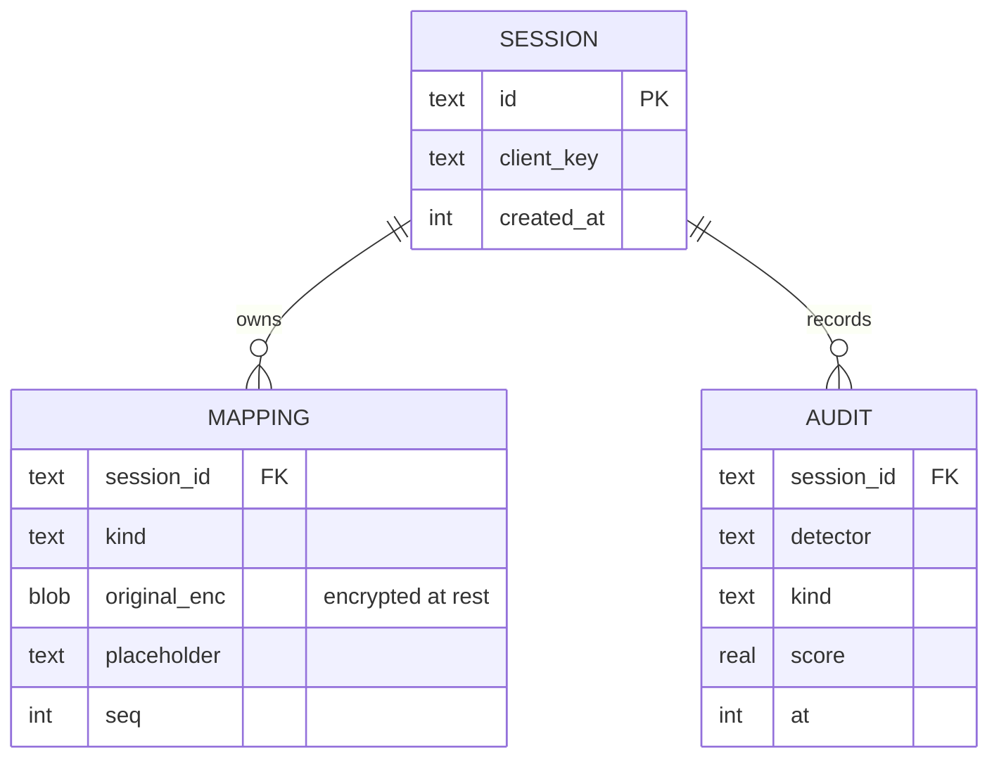

---

## 10. Anonymization & streaming rehydration

Outbound is a pure function. Inbound *batch* is trivial. Inbound *streaming* is the crux: a placeholder splits across SSE chunk boundaries, so naïve string-replace corrupts it.

```rust
/// Outbound transform. Pure over (text, detectors, vault).
pub fn anonymize(text: &str, detectors: &Ensemble, vault: &dyn Vault) -> Anonymized {
    let entities = reconcile(detectors.detect(text));   // det > stat
    let mut out = String::with_capacity(text.len());
    let (mut cursor, mut audit) = (0, Vec::new());
    for e in entities {                                  // left→right, non-overlapping
        out.push_str(&text[cursor..e.span.start]);
        out.push_str(vault.intern(&text[e.span.clone()], &e.kind).as_str());
        audit.push(Redaction { kind: e.kind, detector: e.source, score: e.score });
        cursor = e.span.end;
    }
    out.push_str(&text[cursor..]);
    Anonymized { text: out, audit }
}
```

### The streaming state machine

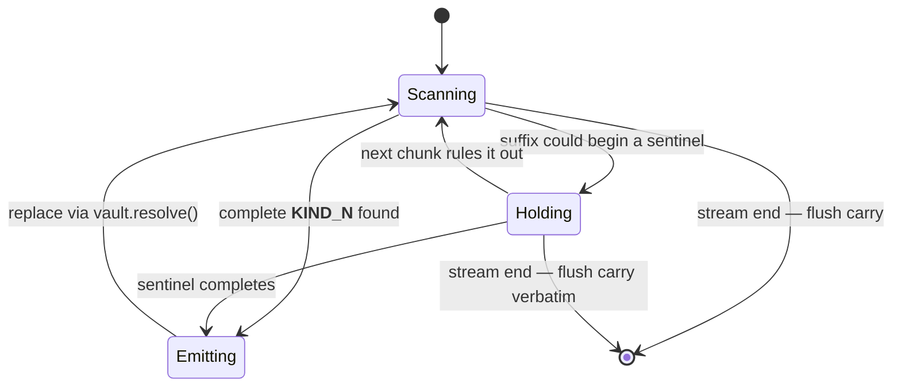

### Why a carry buffer (byte view)

```text
chunk N    : ...the file __PER              emit "...the file ", HOLD "__PER"
                          └ partial sentinel → carry
chunk N+1  : SON_1__ is large               carry + chunk = "__PERSON_1__ is large"
                                           resolve __PERSON_1__ → "Alex"
                                           emit "Alex is large"
```

Added latency is bounded to **one partial token**. The same buffering runs **inside tool-call argument JSON** (arguments arrive as fragmented string deltas).

```rust
/// Wraps the upstream SSE stream; resolves placeholders split across chunks.
pub struct RehydrateStream<S> {
    upstream: S,
    vault: Arc<dyn Vault>,
    carry: String,   // bytes held back: a possible partial __…__
}
// poll_next: append delta to carry → replace every complete __…__ via vault.resolve()
//            → emit safe prefix → retain longest suffix that could begin a sentinel.
//            On upstream end: flush carry verbatim.
```

**Placeholder format:** `__KIND_N__` — all `[A-Za-z0-9_]`. Rationale (revised after live testing): the original guillemet sentinel did **not** round-trip — a free model's constrained tool-argument decoder stripped the delimiters, so the token came back bare and rehydration failed in tool calls (it survived in plain *content*). An underscore-delimited identifier is preserved verbatim by models, works in both content and tool-call paths, and is valid in the function-name charset. Rehydration only replaces tokens already in the vault, so collisions with real `__x__` text are safe no-ops.

---

## 11. Secrets policy — redact-only vs. reversible

The model never needs a literal API key to reason, and you must **not** rehydrate a real key back into code the agent then writes to disk.

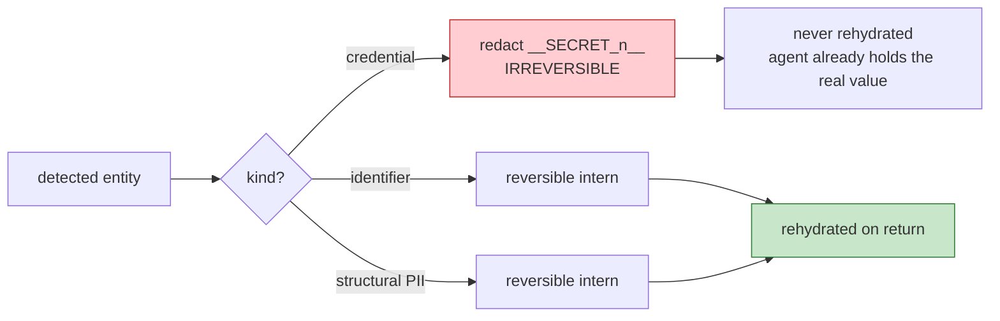

| Tier | Example | Mapping | Rehydrate? |
|---|---|---|---|
| Credential | API key, AWS secret, private key, JWT | redact `__SECRET_n__` | **No** — irreversible |
| Private identifier | name, project, employer | reversible intern | Yes |
| Structural PII | path, email, phone | reversible intern | Yes |

---

## 12. Upstream router — capability-aware failover

Free endpoints rate-limit hard (429) and go down, so failover across the model list is **core, not polish**. And not all free models do tool-calling reliably — routing an agent's tool call to a model that mangles function-calling breaks the loop. So the router **filters by capability before preference.**

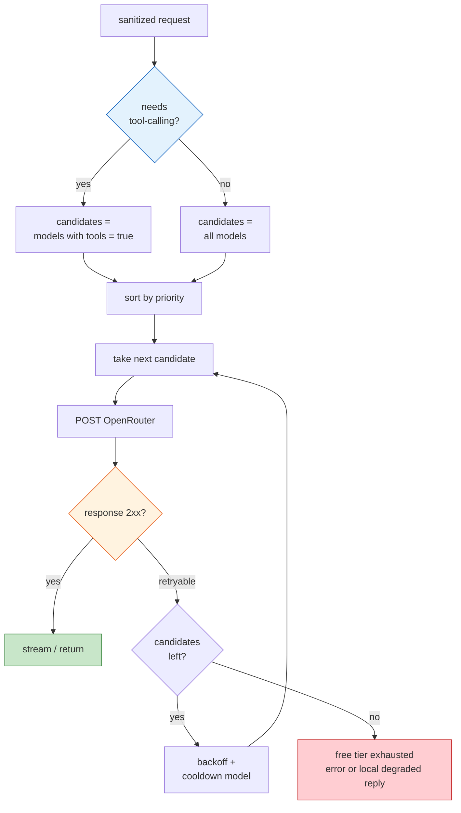

```rust
#[async_trait]
pub trait Provider: Send + Sync {
    async fn complete(&self, req: SanitizedRequest) -> Result<Completion>;
    async fn stream(&self, req: SanitizedRequest)
        -> Result<BoxStream<'static, Result<Chunk>>>;
}
```

---

## 13. Local model — detector, not reasoner

A 0.5B–1.5B model cannot reason, but it is the right **fuzzy semantic detector** over the deterministic floor — catching "the startup I'm building" that regex and gazetteers miss. Falcon-H1-0.5B's **32k context** is the right pick because the thing being scanned is large *tool outputs*, not short prompts. It is async/skippable when in-loop latency matters.

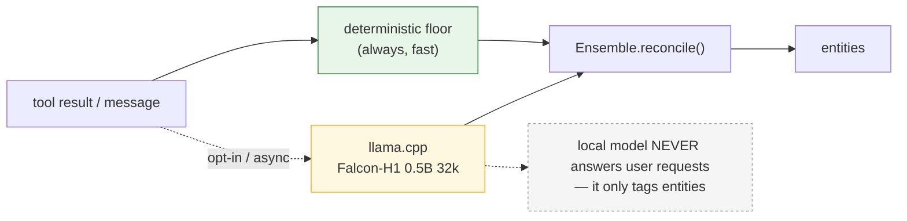

---

## 14. Egress guard

The runtime form of the leak test (and the first thing built, TDD-style).

```rust
/// The sanitized payload must contain NO original currently held in the vault,
/// and a re-detection pass must surface nothing high-risk. Fail-closed by default.
pub fn egress_guard(sanitized: &str, vault: &dyn Vault, detectors: &Ensemble)
    -> Result<(), Leak>;
```

The leak-test harness asserts the same property offline: feed adversarial fixtures (`.env` dumps, stack traces, customer rows) → assert **zero** original PII bytes in the outbound payload.

---

## 15. Configuration

```toml
local_key      = "pp-local-…"            # clients authenticate to the GATEWAY with this
openrouter_key = "env:OPENROUTER_KEY"    # free + revocable; never compiled into source

[[models]]                               # ordered preference; failover on 429 / 5xx / timeout
id = "nvidia/nemotron-3-ultra-550b-a55b:free"
priority = 1
tools    = true                          # tool-call requests only route to tools=true models
context  = 131072

[[models]]
id = "openai/gpt-oss-120b:free"
priority = 2
tools    = true
context  = 131072
# … gemma-4-31b:free / qwen3-next-80b:free / llama-3.3-70b:free …

[detect]
gazetteer = true
regex     = true
entropy   = true
ner       = false            # M2: local llama.cpp pass

[policy]
egress_guard = "fail_closed"
credentials  = "redact_only" # irreversible
placeholder  = "ascii"       # __KIND_N__

[local]
model   = "falcon-h1-0.5b"
context = 32768
role    = "detector"         # NOT a responder
```

---

## 16. Deployment

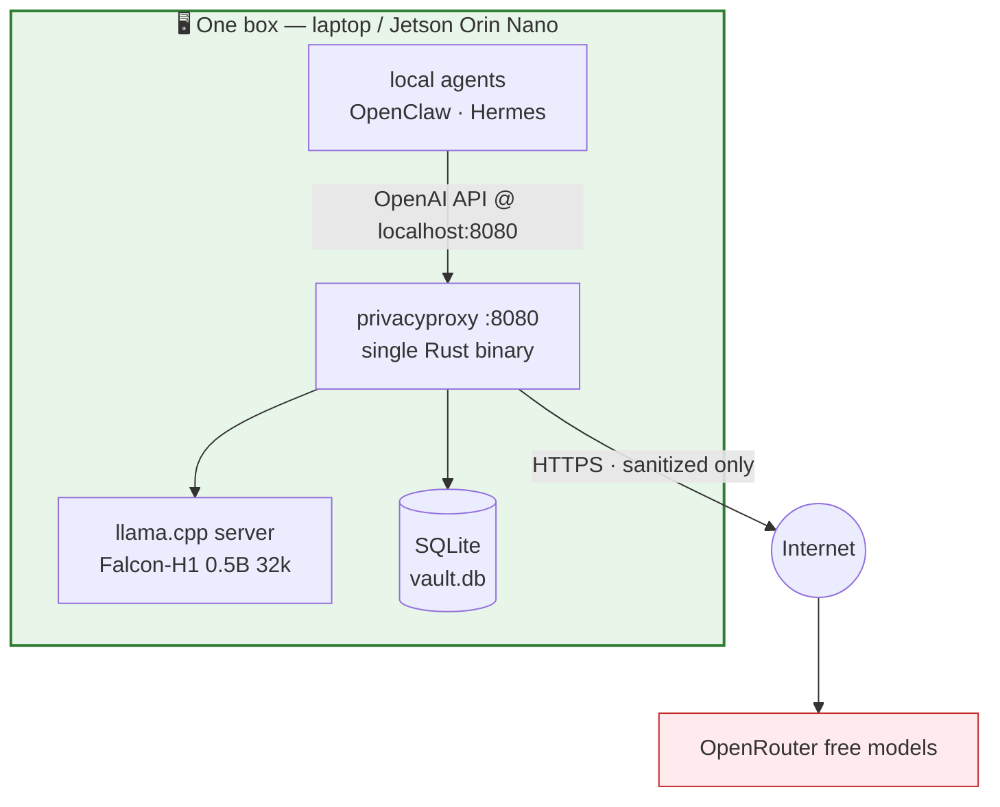

---

## 17. Load-bearing decisions

| Decision | Choice | Why |
|---|---|---|
| Egress guard policy | **fail-closed** | privacy product; safety over convenience |
| Placeholder format | `__KIND_N__` (ASCII id) | preserved verbatim through content **and** tool-call decoders; the guillemet sentinel was not (live finding) |
| Detection floor | regex + entropy + gazetteer (pure Rust) | the guarantee; deterministic & fast |
| NER backend | `ort` (ONNX) or llama.cpp, **opt-in** | pure-Rust deploy on Jetson, no Python runtime |
| Credentials | **redact-only** (irreversible) | model reasons over a marker; never write keys back |
| Vault | SQLite, two-layer, encrypted at rest | reversible map = sensitive, local-only |
| Tool execution | **agent-side** (transparent transform) | any agent plugs in via `base_url` |
| Normalization target | OpenAI Chat Completions | OpenRouter is OpenAI-compatible |
| `dyn` async traits | `async-trait` for `Provider` | RPITIT still not object-safe without boxing |
| HTTP | axum server; `reqwest` + `eventsource-stream` upstream | mature SSE both ways |

---

## 18. Roadmap

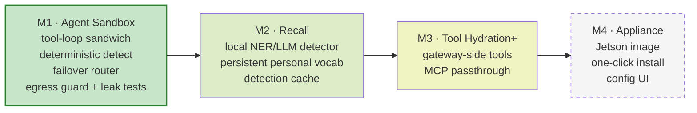

---

## 19. Open questions

1. **Multi-dialect protocol** — do any target agents speak Anthropic Messages (vs. OpenAI Chat Completions)? If so, `pp-protocol` needs a normalized internal representation that all dialects map into.
2. **Detection cache eviction** — content-addressed cache keyed on message hash makes re-anonymizing the growing transcript O(new content); needs a bound for very long trajectories.
3. **Free-model tool-call format drift** — open models vary in function-calling adherence; the router may need a per-model output-repair shim.
