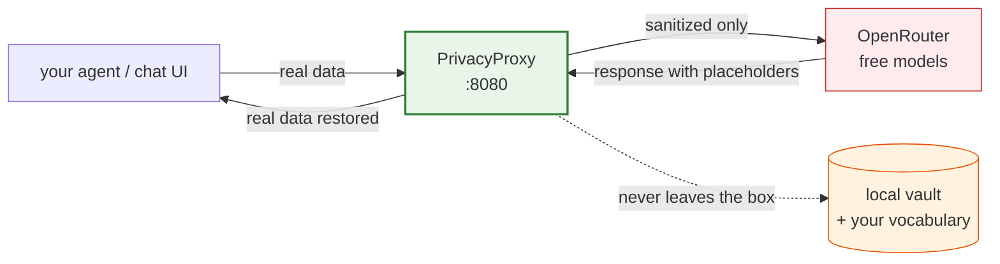

# PrivacyProxy

**An on-device, OpenAI-compatible privacy gateway for AI agents.** Use the strongest *free* models on OpenRouter — the ones that log and train on everything you send — without ever exposing your confidential data.

> Your data stays local. Your reasoning is rented for free.

Point any OpenAI-compatible client (agent, chat UI, IDE) at `http://localhost:8080/v1`. PrivacyProxy anonymizes prompts, tool definitions, and tool-call arguments **locally**, forwards only sanitized text to OpenRouter, and restores your real data in the response — so the cloud model reasons over `__PERSON_1__` and `__PRIVATE_1__`, never `Alex` or `Falcon`.

## Why

The free endpoints are explicit: *"do not upload any confidential information … your use is logged … to improve [the provider's] products and services."* PrivacyProxy is the layer that lets you use them anyway. The adversary isn't a hacker — it's the provider's **lawful logging pipeline** — and the guarantee is one testable property:

> **No bytes you'd consider confidential ever reach the upstream API.**

## Status

Early but working. The M1 core is functional and **validated live** against OpenRouter free models:

| Capability | |
|---|---|
| OpenAI `/v1/chat/completions` (buffered) | ✅ |
| Streaming (SSE) with split-safe rehydration | ✅ |
| Agent tool-calling (tools schema + tool-call arguments) | ✅ |
| Capability-aware failover across free models | ✅ |
| Fail-closed egress guard | ✅ |

Not yet: local NER/LLM detection, multimodal content. See **[ARCHITECTURE.md](ARCHITECTURE.md)** for the full design and roadmap.

## How it works



## Quick start

Requires a stable [Rust toolchain](https://rustup.rs/).

```bash
git clone https://github.com/ai-hpc/PrivacyProxy.git
cd PrivacyProxy
cargo build --release

export OPENROUTER_API_KEY=sk-or-...                 # a free OpenRouter key
export PRIVACYPROXY_VOCAB="Falcon, Acme Corp"        # your private terms
./target/release/privacyproxy                        # listens on 127.0.0.1:8080
```

Then any OpenAI client works unchanged:

```bash
curl -s http://localhost:8080/v1/chat/completions \
  -H 'content-type: application/json' \
  -d '{"model":"auto","messages":[{"role":"user",
       "content":"Email alex@example.com about Project Falcon."}]}'
```

The cloud model receives `Email __EMAIL_1__ about Project __PRIVATE_1__.` — your client gets the real values back.

```python
from openai import OpenAI
client = OpenAI(base_url="http://localhost:8080/v1", api_key="unused")
```

## What gets anonymized

The deterministic detection floor — pure Rust, no external services:

- **Private vocabulary** — your terms from `PRIVACYPROXY_VOCAB` (the primary, most reliable detector).
- **Emails** — `local@domain.tld`.
- **Secrets** — high-entropy tokens (API keys and the like), redacted **irreversibly**: the model sees `__SECRET_1__` and it is never restored.

Reversible entities round-trip (placeholder out, real value back); secrets are redact-only. The same vault drives message content, tool-call arguments, and tool descriptions.

## Configuration

| Env var | Purpose | Default |
|---|---|---|
| `OPENROUTER_API_KEY` | free OpenRouter key | _(required for upstream calls)_ |
| `PRIVACYPROXY_VOCAB` | comma-separated private terms | empty |
| `PRIVACYPROXY_LOCAL_KEY` | require `Authorization: Bearer <key>` from clients | unset → auth disabled (dev) |
| `PRIVACYPROXY_BIND` | listen address | `127.0.0.1:8080` |
| `PRIVACYPROXY_DB` | durable vault path (`:memory:` for ephemeral) | `privacyproxy.db` |

## Limitations (honest)

- **Structural tool fields** (function names, parameter keys) aren't anonymized — they can't carry the placeholder sentinel. If one contains PII, the egress guard **blocks** the request (fail-closed) rather than leak it.
- **Detection is the deterministic floor only** — no semantic NER yet, so PII outside your vocabulary / emails / secrets isn't caught.
- **Two-layer vault** — known vocabulary persists durably (SQLite); emails/secrets/discovered entities are ephemeral per request. Originals are stored as plaintext in the local DB (git-ignored); encryption at rest is a follow-up.
- **Output quality** ≈ free-model ceiling × context surviving anonymization. Coding and agent work fit best, since logic and structure survive masking.

## Project layout

```
crates/
  pp-core        domain types + Detector/Vault traits (no I/O)
  pp-detect      detection floor: gazetteer · email · entropy + reconciliation
  pp-anonymize   anonymize · rehydrate · streaming StreamRehydrator · egress guard
  pp-store       vaults: in-memory · SQLite · two-layer (durable + ephemeral)
  pp-upstream    Provider + OpenRouter client with capability-aware failover
  pp-protocol    OpenAI-compatible wire types
  pp-gateway     the `privacyproxy` binary: axum server + pipeline
```

## Contributing

See **[CONTRIBUTING.md](CONTRIBUTING.md)** — note the non-negotiable privacy contract. Licensed under [MIT](LICENSE).
