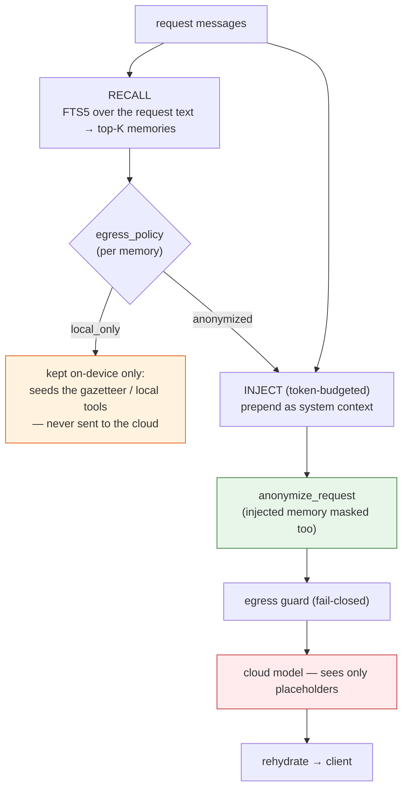
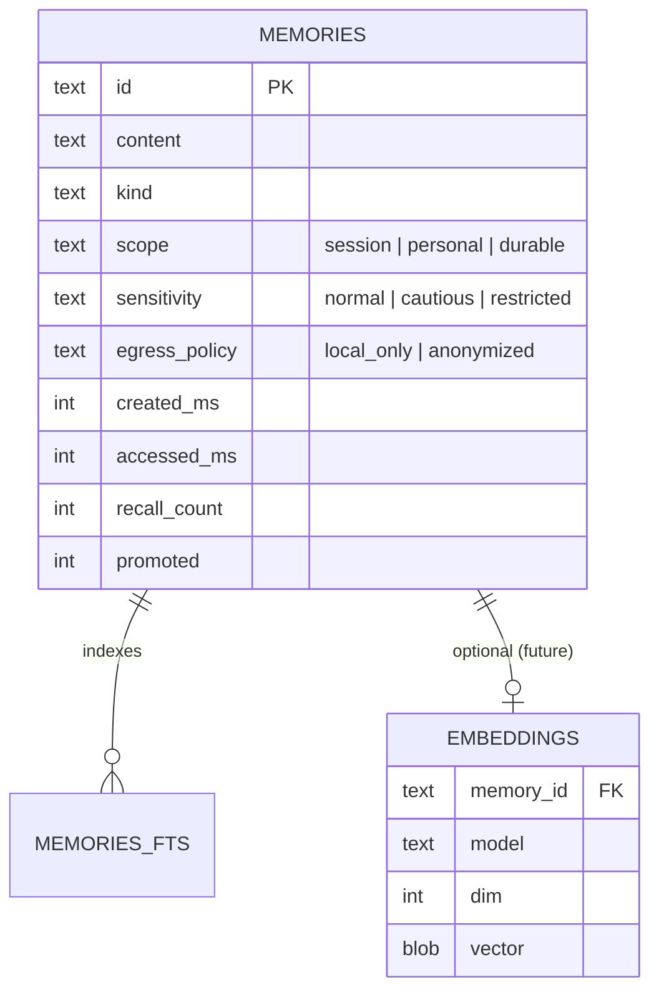
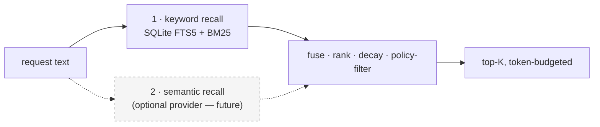

# PrivacyProxy — Memory System Design (M2)

> **Status:** design doc for **M2**. The M1 privacy core (detection · vault · gateway · streaming · tools) is built; this proposes local memory on top of it.
> **Render note:** Mermaid diagrams — view on GitHub / a Mermaid-capable viewer.

## Provenance

This design borrows heavily from **[GeniePod/genie-claw](https://github.com/GeniePod/genie-claw)** — a Rust, on-device, private home-agent harness with a mature memory system (`doc/memory-system.md`, `VECTOR_MEMORY.md`, `crates/genie-core/src/memory/*`). genie-claw's own guidance is to *"borrow architecture and API shape first, and keep code reuse narrow, isolated, and optional"* — that's exactly the approach here. We adopt its good instincts and adapt the one axis that differs for a privacy **gateway**.

### The one structural difference

genie-claw injects recalled memory into a **local** LLM's prompt — real content never leaves the device. PrivacyProxy injects into a **cloud** model, so **recalled memory crosses the same untrusted boundary as user content** and must be treated identically. genie-claw's `SpokenMemoryPolicy` (may this be *spoken aloud in a shared room*?) becomes our **`EgressPolicy`** (may this be *sent to the cloud*, and how?).

## What we borrow / adapt / drop

| genie-claw | PrivacyProxy | |
|---|---|---|
| SQLite store + FTS5 + BM25 ranking | adopt (reuse `pp-store`'s rusqlite + at-rest encryption) | **borrow** |
| policy metadata: `scope`, `sensitivity`, `spoken_policy` | keep `scope`/`sensitivity`; **`spoken_policy` → `egress_policy`** | **adapt** |
| per-query, **token-budgeted** injection ("never dump all memory") | adopt (`inject.rs`'s discipline) | **borrow** |
| `Embedder` / `SemanticIndex` provider boundary (`VECTOR_MEMORY.md`) | adopt the trait shape; default to FTS-only | **borrow** |
| `app_only_secret_references` (say *where* a secret lives, never the value) | adopt as `local_only` "pointer" memories | **borrow** |
| recall tracking · decay · promotion · auditable markdown artifacts | adopt in a later phase | **borrow** |
| table-driven recall test cases (`tests/memory/cases.toml`) | adopt | **borrow** |
| typed household projections (profiles, devices, calendar, inventory, permissions, logs…) | drop — home-domain | **drop** |
| quick router · home control · actuation policy | drop — we're a gateway, not a home agent | **drop** |
| voice / shared-room / spoken disclosure context | drop — our disclosure target is *the cloud*, captured by `egress_policy` | **drop** |
| deterministic "home-phrase" hash embeddings | defer — FTS first; semantic via the provider later | **defer** |

## The privacy adaptation (the crux)

Memory recalled for a request is **prepended to the message array and then flows through the existing M1 pipeline** — so it is anonymized and egress-guarded exactly like user content. No new privacy-critical code; we reuse `anonymize_request` + the fail-closed guard.



**`EgressPolicy`:**

- `local_only` — never injected into a cloud request (secrets, credentials, the most sensitive facts; genie-claw's `AppOnly`/`Deny` for the cloud). May still be used **on-device**: e.g. its terms seed the gazetteer so detection improves, or local tools read it.
- `anonymized` *(default)* — eligible for injection, but only via the path above, so the cloud sees placeholders. Equivalent to genie-claw's `Allow`, plus masking.

There is no "send raw to cloud" tier — that would break the product's one guarantee.

### Synergy: memory makes detection stronger, locally

A `local_only` memory like *"Project Falcon is my startup"* can **seed the gazetteer** at load time, so `Falcon` is always detected and masked — without that fact ever being sent anywhere. Memory and the M1 detection floor reinforce each other entirely on-device.

## Data model

A single source-of-truth `memories` table (FTS5 mirror for keyword recall; an optional embeddings table for the future semantic layer), stored in the same SQLite the personal vault uses — and encrypted at rest with the same `PRIVACYPROXY_DB_KEY` when set.



## Recall (layered, trimmed from genie-claw's four to two + a future)



We drop genie-claw's *structured household projection* layer (it's home-specific) and keep keyword FTS as the baseline. Semantic recall is optional and lands behind a provider boundary (below), exactly as genie-claw recommends — never on the critical path by default.

## Injection (borrowed from `inject.rs`)

Per **query**, not "recent N at startup": search for request-relevant memories, drop `local_only`, then select greedily up to a **token budget** (genie-claw uses ~700 tokens) and prepend as a single system message. *Never dump all memory.* The injected block is then anonymized in-band (see the crux diagram).

## Semantic provider boundary (borrowed from `VECTOR_MEMORY.md`)

`pp-memory` depends on a narrow trait, **not** on any vector backend — so a local embedder (deterministic hash, or a local model via the existing llama.cpp seam) or a future ANN index is optional and swappable. Default runtime stays FTS-only.

```rust
pub struct SemanticHit { pub id: String, pub score: f32 }

pub trait Embedder: Send + Sync {
    fn embed(&self, text: &str) -> Result<Vec<f32>, MemoryError>;
}

pub trait SemanticIndex: Send + Sync {
    fn upsert(&self, id: &str, vector: &[f32]) -> Result<(), MemoryError>;
    fn search(&self, vector: &[f32], k: usize) -> Result<Vec<SemanticHit>, MemoryError>;
}
```
*(Trait shape adapted from genie-claw's `VECTOR_MEMORY.md`.)*

## Write path

- **`POST /v1/memory`** — add a memory `{content, kind, scope, sensitivity, egress_policy}` (local, authed with the gateway key).
- **`GET /v1/memory`**, **`DELETE /v1/memory/{id}`** — list / forget.
- *Future:* opt-in extraction (genie-claw's `extract.rs`) — pull durable preferences/identity facts from conversations, default off.

## Testing (borrowed from `tests/memory/cases.toml`)

Table-driven recall cases: each seeds memories, runs a query, and asserts hit/miss + that the right `egress_policy` filtering happened. Plus the **non-negotiable leak test extended to memory**: assert that a `local_only` memory's content never appears in any outbound payload, and that an injected `anonymized` memory is masked.

## Rollout phases (mirroring genie-claw's Phase 0/1/2)

1. **Phase 1 — FTS + policy + anonymized injection.** New `pp-memory` crate: SQLite `memories` + FTS5 + policy metadata; `/v1/memory` CRUD; per-query, token-budgeted, policy-filtered injection through the M1 pipeline; `local_only` seeds the gazetteer. Table-driven + leak tests. *(No embeddings, no behavior on the critical path unless memory is configured.)*
2. **Phase 2 — semantic provider.** Add `Embedder`/`SemanticIndex`; an optional local embedder; hybrid FTS+semantic fusion. Off by default.
3. **Phase 3 — lifecycle.** Recall tracking, decay, promotion, and auditable markdown artifacts (`memory/YYYY-MM-DD.md`, a promoted `MEMORY.md`), plus opt-in extraction.

## Non-goals

Home/IoT projections, voice and shared-room disclosure, device actuation, and remote vector DBs / GPU ANN on the default path — all dropped from genie-claw as out of scope for a privacy gateway.
